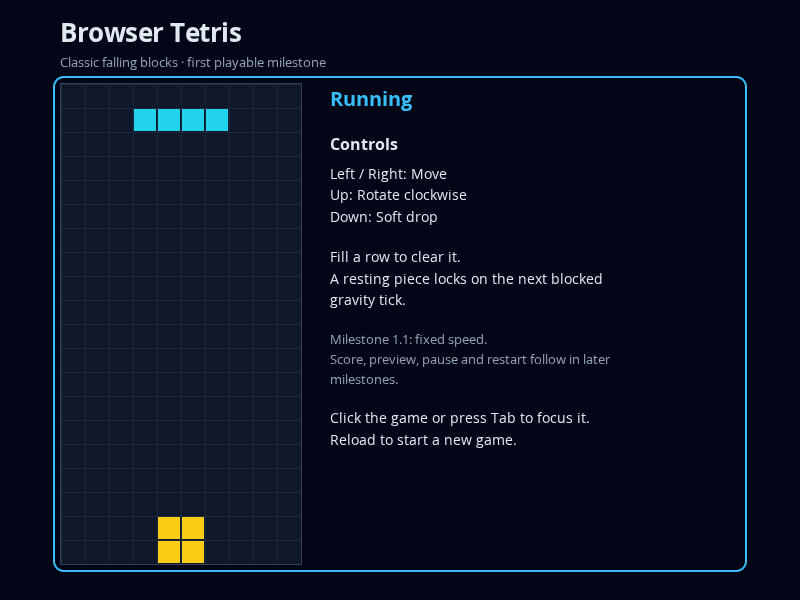

# Milestone 1.1 — Playable falling-block slice

Status: Complete on the phase branch; phase 1 remains incomplete. Reviewed 2026-10-07 using SDD Manager 0.14.9. Scope is T-001–T-008 in [TASKS](../../../TASKS.md), with the milestone exits in [PLAN](../../../PLAN.md) and gameplay contracts in [SPEC](../../../SPEC.md).

## Delivered capability and reviewed state

The ordinary page runs the real TypeScript engine, Canvas renderer, focused arrow-key adapter and one frame chain. Seven-piece bags feed centered spawns. Legal movement, clockwise rotation without kicks, soft drop, fixed one-second gravity, next-blocked-tick locking, simultaneous row clearing and blocked-spawn game over are delivered. Resting contact and blocked soft drop leave a piece active; movement and rotation preserve the scheduled tick.

Execution began at `bf1b05e0621c79be4c21cf9ddd23dcd0604d7cef`. The reviewed delivery tip is `bd3219329d871d78506ea3742ce6b77032cd38a0`, plus the T-008 repairs to browser-runtime.ts, toolchain.spec.ts, index.html and README documented below. The commit containing this report persists those repairs and checklist completion together.

| Task | Delivery commit | Result |
| --- | --- | --- |
| T-001 | `be6619a` (partial predecessor `c054ef4`) | Locked toolchain and real packaged Chromium launch |
| T-002 | `576bc2f` | Domain contracts and all specified geometry |
| T-003 | `884757b` | Occupied-cell placement, legal lock and stable compaction |
| T-004 | `6d4c90a` | Seven-piece shuffle and controlled sources |
| T-005 | `6a6b8c9` | Fixed-speed actions, time, locking, clear, promotion and terminal state |
| T-006 | `635f219` | Snapshot-to-pixel rendering correspondence |
| T-007 | `bd32193` | Ordinary-page input/gravity, controlled browser clear/game over |
| T-008 | This report's commit | Whole-slice review, font repair and verified checkpoint |

## Code inspection

Inspection was performed separately from test execution. Reviewed all engine, session, view and entry modules, tool/configuration setup, test fixtures, scenario helpers and developer instructions against the milestone's bounded contracts.

The engine imports only engine-domain modules; snapshots copy rows and active-piece values. Occupied cells govern placement and rejection, rather than empty frame cells. Lock/clear/promotion is owned by Game, with terminal processing stopping the tick loop. Manual actions do not modify the accumulator. Board compaction preserves remaining-row order. Source shuffling permits every permutation. Renderer reuses canonical geometry and clears stale drawings. Controller owns its subscription and frame handle; repeated start is guarded. Test-controlled sources/time are assembled outside product sources, with no production debug global or state-loading API.

Full initialization/runtime fault handling, repeat/filter semantics, interruptions and disposal acceptance remain explicitly assigned to later milestones; they are not asserted complete by the baseline controller. Source/API comments and README accurately describe this slice.

## Findings / blockers and repairs

- **M1.1-F001 — Browser fonts absent (blocking evidence/usability defect, fixed in T-008).** Screenshot review showed empty title/status/instructions despite passing DOM text assertions. Packaged fonts.conf referenced Lambda paths instead of the repository cache. Added a local font configuration pointing to extracted fonts and a real Canvas glyph-rasterization smoke assertion. The new assertion failed before repair and passes after it. Open Sans lacked arrow symbols, so visible key instructions now use Left/Right/Up/Down words. Final 800 × 600 screenshot visibly shows title, status, controls and board without overlap. An intermediate replaceAll typecheck error was repaired with ES2020-compatible regular-expression replacement; target was preserved.
- **M1.1-F002 — Second browser context fails (blocking environment defect, fixed in T-007).** The vendor's single-process flag allowed one smoke case but caused Target closed on successive Playwright contexts. Removing that flag permits multiple processes; all six browser cases now pass in one worker with separate contexts. No assertion was weakened.
- Initial standard Playwright browser downloads returned HTML rather than archives. Developer explicitly approved the available packaged browser route. Installation uses pinned npm assets, disables extraction ownership changes unsupported in the sandbox, and stays within repository test infrastructure. Chromium 153.0.8010.0 differs from Playwright's standard patch build; compatibility is established for this suite, not claimed universally. Windows/other platforms retain standard Playwright installation and are unverified here.

Unresolved milestone blockers: None.

## Executed verification

Environment: Linux x64, Node 24.19.0, npm 11.9.0; TypeScript 7.0.2, Vite 8.3.3, Vitest 5.0.3, Playwright Test 1.63.0, @sparticuz/chromium 153.0.0 (Chromium 153.0.8010.0). Exact dependencies are locked. Per-task RED/GREEN chronology and setup repairs remain in TASKS; scaffolds and already-passing cases are identified honestly there.

| Actual command / check | Outcome and coverage |
| --- | --- |
| `npm ci` (T-001) | Passed locked installation; direct dependency listing has no unmet dependency |
| `npm test` | 36/36 pass across four engine suites: all frames, bounds/stack, 1–4/nonadjacent compaction, all 5,040 shuffle permutations, grounded movement/rotation, soft-drop no-op, controlled clear, fractional residuals and terminal spawn |
| `npm run typecheck` | Passed strict product/test/configuration checking |
| `npm run build` | Passed typecheck and explicit ES2020 Vite static build |
| `npm run test:browser` | 6/6 pass: ordinary keys/frame gravity/lock, clockwise rotation, controlled clear, blocked spawn/terminal preservation, all 200 cell-center pixels/redraw, launch/page/glyph rendering |
| Fresh-cache `npm run test:browser` | 6/6 pass after safely moving the prior generated cache aside; new extraction/font configuration are reproducible |
| Visual inspection | Final ordinary page at 800 × 600 has readable controls/status and square-cell board; controlled renderer screenshot matches the verified state |
| `git diff --check`, import inspection, ignore check | Passed; dependency direction holds, credential remains ignored/untracked, final .obsidian/.trash rules preserved |

Existing npm http-proxy and NO_COLOR/FORCE_COLOR warnings are non-fatal. A browser process reported a sandbox NETLINK denial during earlier failed runs. No broader OS/browser compatibility or complete production acceptance is inferred from these results. Real ordinary-page frames are exercised with Playwright's controlled clock; clear/game-over fixtures use real adapters with deterministic sources/scheduling.

[Controlled rendering evidence](rendered-board.png) samples locked and active cells. These selected images contain only the demo game; other generated test output is not retained.

## Exit assessment and limits

Milestone 1.1 exits pass: real ordinary-page play, deterministic locking/clear/game-over evidence, browser launch, strict checking and build. A-01/A-02/A-03/A-04/A-06/A-07/A-09 are covered only in this milestone's planned portions. Full acceptance remains pending.

Scoring, cleared-line totals, level-dependent speed and visible preview are 1.2. Pause/resume/restart, complete key filtering and blur/visibility handling are 1.3. Complete presentation, faults/disposal and invariant hardening are 1.4. Production static play and complete acceptance are 1.5/1.6. Snapshot counters remain 0/0/1 at this checkpoint. Reload starts another session. These are planned increments, not deferred review defects.

## TODO

None.

## Publication and stopping boundary

Working branch: `phase/1-classic-browser-tetris`; target: `main`. Each completed delivery checkpoint was pushed and its remote tip read back before advancing. T-008 pushes this report, retained images, repairs and task/milestone status together; the completion response verifies remote containment. Hosted tracking is inactive.

Stop after T-008 / milestone 1.1. The incomplete phase remains on its published branch; main stays at `bf1b05e0621c79be4c21cf9ddd23dcd0604d7cef`. No merge or full-project completion is claimed. The next selectable range is T-009–T-012 (scoring, progression, preview and milestone review), subject to the developer's next direction.

## Subsequent hosted reconciliation

After this milestone's local review checkpoint, the developer confirmed GitHub tracking on 2026-10-07 at 15:04 Europe/Moscow. Phase 1's label, all six native milestones and 26 task issues were projected and read back. This milestone's constituent task issues, including its review task, were closed with their existing pushed commits and verification evidence; its GitHub milestone was then closed and read back. This is late activation of tracking, not additional product implementation or target integration. The earlier inactive-tracking statements describe the state at the original review checkpoint.

Hosted milestone: [1.1](https://github.com/pchemguy/SDD-Manager-Demo-Tetris-ChatGPT-Work/milestone/1). Current tracking context: [TASKS](../../../TASKS.md).
