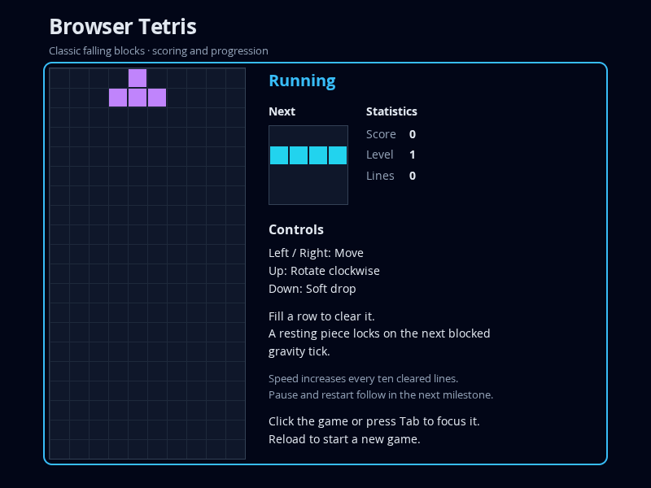

# Milestone 1.2 — Scoring, progression, and preview

Status: Complete on the phase branch. Phase 1 remains incomplete. Reviewed 2026-10-07 with SDD Manager 0.14.9. Scope: T-009–T-012 in [TASKS](../../../TASKS.md), [PLAN](../../../PLAN.md) milestone 1.2, and [gameplay](../../../spec/gameplay.md) G-05/G-06 plus [presentation](../../../spec/session.md) S-04/S-05.

## Delivered capability and source

The game tracks score, cleared lines and level. A lock clearing 1/2/3/4 rows awards 100/300/500/800 multiplied by the pre-clear level. Every ten cleared lines increases the level. Gravity uses max(100, 1000 × 0.8^(level − 1)) milliseconds, preserving fractional time and promotion residuals. A level-changing clear immediately applies the resulting level's interval to remaining time. Drops award no points.

The ordinary page displays live counters and an orientation-zero next-piece preview. Promotion updates both board and preview. The real engine/controller/rendering path and next-blocked-tick locking remain intact.

Starting checkpoint: `6e2207c4295ea079c7c052d2bd90154cf094ce9b`. Reviewed application source: `f7ecc6695f77a0a99217c42f7251cbf8f00303e7`; T-012 adds a progression-regression test and this report/checklist evidence, with no further product change.

| Task | Commit | Capability |
| --- | --- | --- |
| T-009 | `e1e1ac0` | Counters, pre-clear scoring, public-action 1–4-row recipes |
| T-010 | `01f01db` | Level-dependent intervals, speed floor, residual active time |
| T-011 | `f7ecc66` | DOM progression and all seven previews |
| T-012 | This report's commit | Whole-milestone review, coverage repair, final checks |

## Code inspection

Code inspection was separate from execution of checks. Reviewed the entire Game coordinator and its geometry/board/source dependencies, timing and progression tests, rendering/status/entry changes, controlled fixtures, page/CSS and README against the milestone exit.

Score is computed before updating line totals; level is derived from totals. The elapsed loop subtracts the pre-tick interval before any clear and reads the updated interval on its next iteration. Actions never reset timing or change counters. Game-over guards preserve earned progression. Preview uses canonical shape geometry at orientation zero, a separate Canvas context and a fresh background on redraw; it does not read locked board cells. DOM counters consume snapshots rather than owning gameplay state. Controller scheduling and keyboard scope remain unchanged. Public-action recipes avoid private state loading, production debug globals and dependencies from product code into tests.

The optional preview/counter collaborators preserve existing focused renderer fixtures. The ordinary entry supplies them. Full initialization validation, input filtering, pause/restart and fault/resource acceptance remain assigned to later milestones.

## Findings / blockers

**M1.2-F001 — Nonzero-score preservation coverage gap (fixed in T-012).** The zero-bonus test used score zero, so an accidental score reset could survive it. Added a public-action scenario that earns 300 points, rejects wall movement and no-kick rotation, locks without clearing, reaches game over and exercises terminal input/time. Earned counters and final state are preserved. This already-working behavior passed on its first characterization run; no historical RED is claimed for that additional case.

No confirmed product bug or unresolved milestone blocker remains. The speed test's initial exact-640 threshold encountered the specified power's floating-point representation, 640.0000000000001. The corrected test permits 0.000001 ms tolerance, consistent with G-06, without rounding engine time or concealing a wrong interval. Task evidence records all observed failures and setup limitations.

## Executed verification

Environment unchanged from [milestone 1.1](1.1.md): Linux x64, Node 24.19.0/npm 11.9.0, pinned TypeScript/Vite/Vitest/Playwright dependencies and packaged Chromium 153.0.8010.0. No dependency changes were needed.

| Actual check | Result / coverage |
| --- | --- |
| `npm test` | 51/51 pass in six suites, including all prior engine regressions |
| Progression suite | 7/7: final 0–4-row outcomes, old-level scoring across 8→12 lines, subsequent multiplier, zero bonuses and earned-state preservation |
| Timing suite | 8/8: levels 1/2/3, 100 ms floor at levels 12/25, grounded level-2 next-tick locking, fractional time and partitions spanning promotion/level change |
| `npm run typecheck` | Passed strict product/test/configuration checking |
| `npm run build` | Passed typecheck and ES2020 static build |
| `npm run test:browser` | 15/15 pass, including all six prior browser cases |
| Preview/progression browser checks | Ordinary counters/preview; all seven kinds' literal orientation-zero pixels/colors; controlled 1200/8/1→1500/10/2 clear; T promotion and I preview redraw |
| Visual inspection | Ordinary 800 × 600 page shows readable counters, preview, controls and full square-cell board without overlap |
| `git diff --check` / publication checks | Whitespace clean; ignored/untracked credential and final ignore rules retained; each delivery commit pushed/read back before advancing |

Progression tests observed five failures before scoring implementation; zero-bonus behavior already passed. Timing RED included four direct speed/residual failures and three higher-level setups blocked by absent speed changes; level 1 already passed. Two browser scenarios failed before preview/counter implementation. Seven additional preview checks passed existing behavior and are not represented as new RED cycles. Exact task evidence is retained in TASKS.

Existing npm proxy and color-environment warnings remain non-fatal. This evidence covers the available Chromium environment; Windows and other browsers were not tested. Full production static play, output/network acceptance and failure handling remain later milestones.

## Exit assessment, TODO and boundary

Milestone 1.2 exits pass: scoring/line totals/level boundaries, speed floor and residual time, browser preview promotion/counter updates, and prior gameplay regressions. Relevant A-01/A-03/A-04/A-07 coverage is extended; complete project acceptance is not claimed.

TODO: None.

Work is published on `phase/1-classic-browser-tetris`, targeting `main`; hosted tracking is inactive. The completion response verifies the report commit's remote containment. The incomplete phase is not merged, and main remains at `bf1b05e0621c79be4c21cf9ddd23dcd0604d7cef`.

Stop after T-012 / milestone 1.2. Next selectable range: T-013–T-016, implementing pause/resume/restart, complete keyboard/command handling, browser interruptions and its milestone review. Await the developer's next direction.
