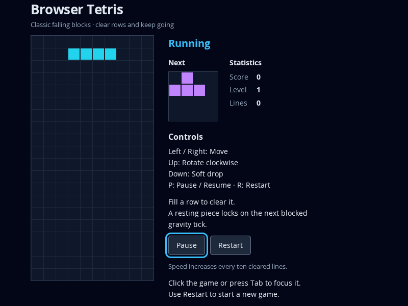
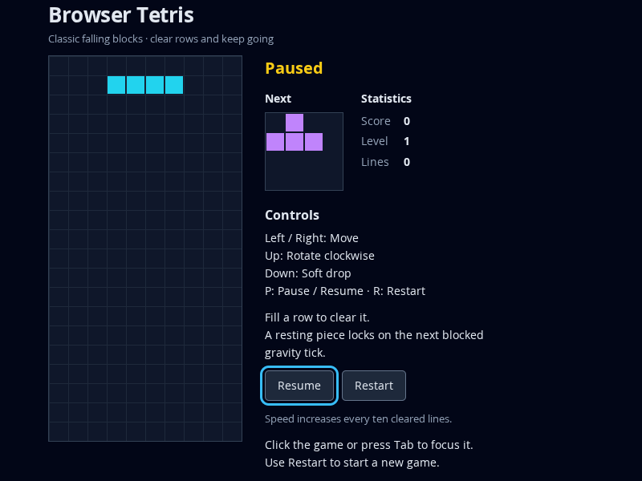

# Milestone 1.4 — Robust presentation and failure boundaries

## Scope and reviewed state

T-017–T-021 on `phase/1-classic-browser-tetris`, targeting `main`. Delivery review baseline: `6a11be2850569c52463a3b3a3115c28f729988f8`; T-021 adds independent-context/type coverage in its report commit. Main agent performed code inspection separately from check execution; no independent reviewer is claimed. [SPEC](../../../SPEC.md), [session contracts](../../../spec/session.md), [PLAN](../../../PLAN.md) and [TASKS](../../../TASKS.md) govern exits.

Delivered full desktop controls/presentation, pre-start element/Canvas validation and fallback errors, source identity validation, source/scheduler fault containment, permanent disposal, and explicit elapsed/snapshot invariants. Faults preserve the last available drawing and counters, release processing resources and disable commands; fixed error messages expose no caught exception details.

## Code review and findings / blockers

Inspected all engine, session, entry and view paths against S-04/S-05/S-06 and A-01/A-07/A-08. Board and active state remain engine-owned; rows/piece snapshots are detached. Invalid elapsed values reject before the inactive-status check. Source validation applies to active, preview, promotion and restart consumption. Controller guards commands/start/frame/interrupt processing, owns resource cleanup, handles pagehide, and cannot be restarted after disposal. Error view is separate from game over; initialization resolves every required node and both contexts before constructing active resources.

**M1.4-F001 — Independent Canvas/type coverage gap (closed in T-021).** The initial missing-context test made both contexts unavailable, so a missing preview-only guard could survive it. Added board-only and preview-only context failures and wrong board/button element types; all four pass existing validation as characterization. No production repair or historical RED is claimed for these coverage additions.

T-019's browser observer initially counted Playwright-owned listeners. Its corrected scope tracks the application's exact target/event pairs; source, scheduling, restart-source fault and repeated disposal cases now independently show zero owned frames/listeners. That setup repair did not weaken the production lifecycle contract. The initial focus-outline test also assumed a particular outline style; it was corrected to check a visible nonzero outline instead.

No unresolved implementation bug, critical issue or contract violation was found. [M1.3-L001](1.3.md) remains an environment evidence limit: browser blur/visibility are controlled events/properties, not native desktop tab-switch verification.

## Executed verification

| Check | Observed result |
| --- | --- |
| `npm test` | 85/85 pass in eleven suites, including 14 invalid-time/snapshot cases and source/controller fault cases |
| `npm run build` | Strict typecheck and ES2020 static build pass |
| `npm run test:browser` | 43/43 pass: all normal gameplay/session regressions, two presentation checks, 15 initialization checks and six fault/disposal checks |
| Viewport/visual evidence | Inspected 800 × 600 screenshot; square-cell board, preview, readable counters/instructions and visible focused controls fit without overlap or horizontal scrolling |
| Mutation/resource evidence | Invalid elapsed input preserves state/remainder in all statuses; snapshots cannot mutate nested state; failures leave no owned gameplay subscriptions or frames and ignore later commands |
| Publication/tracking | T-017–T-020 pushed/read back and their exact task issues closed; review task and milestone close after report publication |

Environment: Linux x64, Node 24.19.0/npm 11.9.0, Chromium 153.0.8010.0 / Playwright 1.63.0. Existing proxy/color warnings remain non-fatal. No Windows or other-browser claim is made. Complete locked/static production evidence remains milestone 1.5 work.

## Exit assessment, TODO and continuation

Milestone 1.4 exits pass: complete desktop interface, initialization/runtime failure boundaries, resource disposal and engine input/isolation guarantees with prior gameplay/session regressions. A-01/A-07/A-08 have their required implementation evidence within the recorded browser-event coverage limit.

TODO: None for product implementation. Native desktop focus/visibility testing remains an explicit compatibility evidence limit.

The selected range continues through T-026. Hosted milestone [1.4](https://github.com/pchemguy/SDD-Manager-Demo-Tetris-ChatGPT-Work/milestone/4) closes after published review and constituent issue readbacks. Full phase integration is pending.
