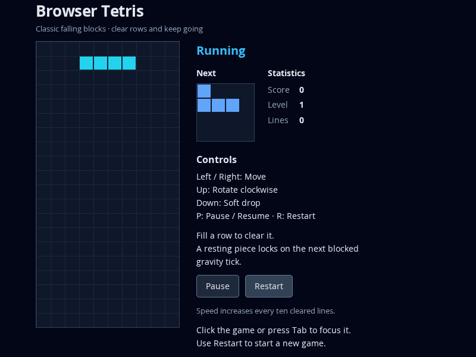
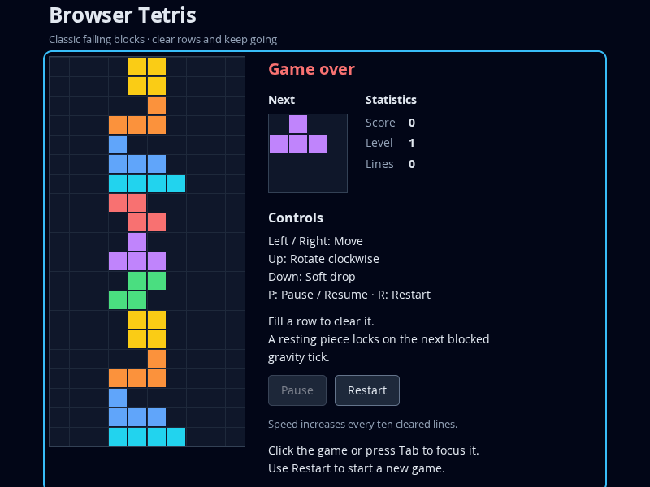

# Phase 1 acceptance evidence

## Verified scope and limits

T-023 verification on the phase branch: `npm ci`, `npm run typecheck`, `npm test` (85/85), `npm run build`, and `npm run test:browser` (44/44) pass. The browser command automatically builds and serves static production content as well as development fixtures. Browser/runtime: Linux x64, Node 24.19.0/npm 11.9.0, Chromium 153.0.8010.0 with Playwright 1.63.0.

This matrix maps [SPEC acceptance](../../../SPEC.md#end-to-end-acceptance) to actual suites and observed outcomes. Production tests use the unchanged built entry; browser time/randomness are controlled to make game over reproducible. Deterministic row-clear/source/failure fixtures remain outside the shipped graph. Native desktop blur/visibility delivery is unverified: headless shell keeps pages focused/visible; browser tests model those properties/events and unit adapters verify timing independently. Windows/other browsers are not tested. T-024 shipped asset/network inspection is verified below.

| ID | Concrete executed evidence | Result / boundary |
| --- | --- | --- |
| A-01 | `progression-preview.spec.ts` startup, `presentation.spec.ts`, `production.spec.ts` literal I cells and counters | Empty locked board plus active/preview, zero score/lines, level 1, readable instructions and full desktop interface |
| A-02 | Unit `pieces`, `board`, `game`, `timing`; `playable-slice.spec.ts`; built-page production movement/rotation/locking | All seven literal geometries, collisions, rejected actions, grounded movement, blocked soft drop and scheduled next-tick lock |
| A-03 | Unit `progression` and `timing`, `board` stable compaction; `progression-preview.spec.ts` 8→10-line browser clear | 1–4 clear scores, old-level multiplier, level/interval transitions, residual time and 100 ms speed floor |
| A-04 | Unit `piece-source`, all seven browser preview pixel cases, controlled promotion | Every seven-piece bag and all 5,040 shuffle permutations checked; preview/promotion and deterministic source seam match |
| A-05 | Unit `lifecycle`/`controller`; `input.spec.ts`/`session.spec.ts`; built-page pause/restart | Frozen state/remainder, explicit eligible resume, hidden/unfocused start/restart, no duplicated frame/input effects; native-event limit above |
| A-06 | Unit `game`/`lifecycle`; controlled blocked-spawn browser case; ordinary built-page stack-to-game-over and restart | Terminal time/input no-op and fresh playable reset; final board/counters remain visible |
| A-07 | `rendering`, `progression-preview`, `input`, `session`, `presentation` and `production` browser suites | Actual occupied/empty/color pixels, real keys/buttons/focus/defaults, status updates and restart; controlled interruptions distinguish handler evidence from native delivery |
| A-08 | Fourteen unit `invariants` cases; five unit `source-faults` cases; fifteen `initialization` and six `failures` browser cases | Invalid time before mutation; deep detached snapshots; missing DOM/contexts/type fallback before active resources; safe stopped runtime faults/disposal |
| A-09 | Locked `npm ci`; strict typecheck; unit/build/browser commands; ordinary built page under static HTTP | Reproducible commands/static play and inspected static assets pass; production requests only same-origin GET files, with no sockets, harnesses or external gameplay service |

## Retained visual evidence

Full milestone consolidation belongs to the T-025 report; complete phase and published integration evidence belong to T-026. This evidence file does not independently mark a task, milestone or phase complete.

## T-024 output, runtime and fresh-cache verification

Inspected output consists of `index.html` (1,664 bytes), one CSS asset (1,698 bytes) and one JavaScript asset (9,635 bytes). The production import graph is confined to application modules/CSS. No test fixtures, debug harness, browser package, hosting credential/path or actual credential value is shipped. Credential files are ignored/untracked; the final `.obsidian` and `.trash` ignore rules remain intact. Credential checks emit no values.

The production network assertion observes HTML/CSS/JavaScript GETs solely from the static server, no WebSocket connections, no page/console errors, and no fixture controls. External requests are blocked by the test while keyboard/pause/restart remain functional. Source inspection finds no runtime service calls.

Preserved the generated browser cache aside and forced fresh extraction of pinned assets. `npm run test:browser -- tests/browser/production.spec.ts tests/browser/toolchain.spec.ts` passes 3/3, including full built-page play/restart, network independence and text glyph rasterization. Strict typecheck passes. This verifies the fresh setup with successive browser contexts; it does not claim compatibility beyond the observed platform/browser.
